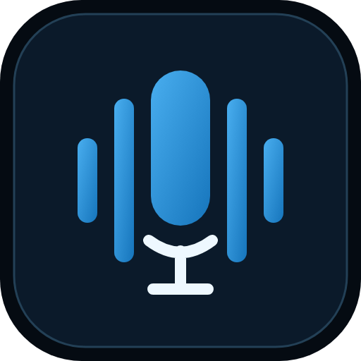

# Sal0 Voz



Estúdio pessoal de voz para **Docker no ZimaOS**, com interface em português, personagens versionados, roteiros, fila persistente e processamento local em CPU.

**Versão 0.2.0 — primeira versão funcional, com recursos avançados ainda em validação.** Não representa a conclusão integral do guia nem uma qualidade equivalente ao ElevenLabs.

## Instalar no ZimaOS

1. Importe [docker-compose.yml](docker-compose.yml) como aplicativo personalizado.
2. Confira a pasta de dados: o exemplo usa `/DATA/AppData/sal0-voz`.
3. Inicie e abra **http://IP-DO-ZIMAOS:7886**.
4. Crie sua senha local.
5. Em **Criar voz**, escreva um texto e gere com a **Voz simples**, pronta para testar.
6. Para clonagem, escolha **Clonar uma voz**, envie uma gravação e sua transcrição na mesma tela. Para legendas, envie o áudio diretamente em **Gerar legendas**.
7. Acompanhe o preparo automático dos modelos no aviso da tela inicial ou em **Ajustes**. Trabalhos enviados durante o download aguardam e começam automaticamente.

A imagem usada pelo Compose é `ghcr.io/sal0-apps/sal0-voz:latest`. O workflow **CI e imagem Docker** testa, constrói e publica `latest`, além da versão fixa `0.2.0` e do SHA do commit para rollback. Ao iniciar, o servidor baixa automaticamente `qwen-0.6b` e `whisper-medium` para o volume `/data`; os downloads também podem ser acompanhados e iniciados em Ajustes. Se o pacote GHCR ainda estiver privado, o administrador deve torná-lo público na página do pacote para permitir download anônimo pelo ZimaOS.

## O que está implementado

- Identidade Sal0, ícones SVG/PNG/ICO locais, tema claro/escuro e interface para computador/celular.
- Contas de usuários e administradores, sessões, proteção de origem e arquivos acessíveis somente após login.
- Configuração de Telegram por usuário para receber status e arquivos concluídos diretamente do servidor.
- Biblioteca com importação validada por FFprobe.
- Personagens com versões imutáveis; trabalhos preservam uma cópia do personagem usado.
- Editor com autosave, projetos e histórico de revisões.
- VoiceScript básico: personagem, idioma, pausa exata, ritmo e volume.
- Fila SQLite, um executor pesado por vez, pausa, cancelamento da árvore de processos e retomada por checkpoint validado com SHA-256.
- TTS de diagnóstico real em pt-BR/en-US com eSpeak NG.
- Adaptadores locais Qwen3-TTS 1.7B/0.6B Base (clonagem) e Faster-Whisper medium/large-v3 CPU INT8.
- WAV, FLAC, MP3, Opus, SRT/VTT; legendas de TTS com tempos por trecho, sujeitas a revisão.
- Dublagem por SRT revisado, personagem por fala e ambiente separado opcional. Excesso de duração acima de 10% exige revisão, sem cortar palavras.
- Download automático e manual de modelos no próprio servidor, com revisão fixa, licença, estimativa de tamanho e hashes; o navegador recebe apenas o status.
- Backup/restauração portável por CLI, inventário de hardware e healthcheck.

## Ainda pendente

- Benchmark dos modelos no AMD A10-9700E/16 GB e avaliação auditiva pt-BR/inglês.
- Validação da clonagem real com referências do proprietário.
- VoxCPM2 e Chatterbox como candidatos adicionais.
- Conversão direta de voz, tradução automática, separação/diarização, emoções/reação nativas, voice design e treinamento.
- Alinhamento por palavra, editor gráfico de forma de onda, comparação de tomadas e testes extensivos de vídeo longo.
- Homologação no ZimaOS e teste com rede externa bloqueada no servidor real.

O app não troca um clone indisponível por uma voz pronta. O modo Trocar voz permanece identificado como pendente.

## Construir a imagem

```sh
docker compose -f compose.yaml build
docker compose -f compose.yaml up -d
```

Use `compose.yaml` para desenvolvimento/preparação, e `docker-compose.yml` para importar a imagem publicada no ZimaOS. Não monte a pasta do host sobre `/app`.

## Desenvolvimento e testes

Python 3.11/3.12, FFmpeg/FFprobe e eSpeak NG:

```sh
python -m venv .venv
. .venv/bin/activate
pip install -r requirements-dev.txt
python -m pytest -q
python -m uvicorn app.main:app --host 127.0.0.1 --port 7886
```

Use apenas **um processo Uvicorn**. Os ambientes de IA ficam isolados em `/opt/engines` na imagem. O navegador não carrega os modelos.

[Manual completo](MANUAL.md) · [Guia original](Guia_Sal0_Voz_Local.md) · [Estado dos testes](VALIDACAO.md)

